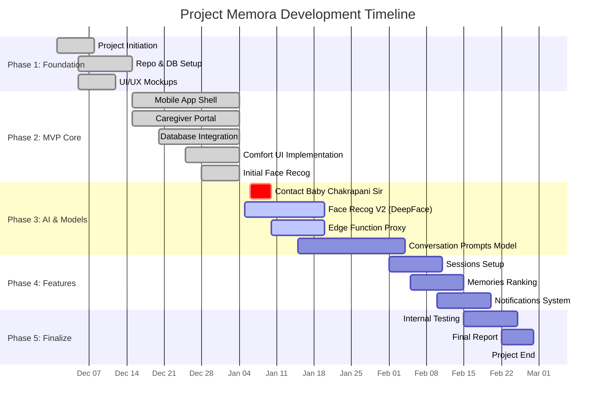

# Project Memora: Timeline & Gantt Chart Data (Revised)

**Project Start:** December 1, 2025
**Target Completion:** February 28, 2026 / March 1, 2026

## 📊 High-Level Timeline Summary

*   **Month 1 (Dec 2025):** Foundation, Infrastructure, & Core MVP Features.
*   **Month 2 (Jan 2026):** Deep AI Integration (Face Recog Upgrade, Prompt Generation Model) & Data Acquisition.
*   **Month 3 (Feb 2026):** Feature Completeness (Sessions, Notifications, Ranking), Internal Testing, & Final Documentation.

---

## 📅 Detailed Task Breakdown for Gantt Chart

### Phase 1: Foundation & Infrastructure (Dec 1 - Dec 14)
*   **Project Initiation:** Define core concept & clinical scope.
*   **Setup:** Initialize Repos (Mobile, Portal), Configure Supabase (Auth, DB, RLS).
*   **Design:** UI/UX Mockups (Figma), Database Schema Design.

### Phase 2: MVP Core Development (Dec 15 - Jan 5)
*   **Mobile App Shell:** React Native (Expo) setup, Navigation, Patient Home. [COMPLETED]
*   **Caregiver Portal:** Next.js Web App, Auth, Patient Management. [COMPLETED]
*   **Database Integration:** `FamilyMember` and `Memory` tables linked to UI. [COMPLETED]
*   **Feature - Comfort UI:** Auto-scrolling carousels for easy accessibility. [COMPLETED]
*   **Initial Face Recog:** Initial implementation (Superseded by V2). [COMPLETED]

### Phase 3: Advanced AI & Models (Jan 6 - Feb 5)
*   **Data Acquisition:** Contact Baby Chakrapani Sir (Biotech) for database access. [IMMEDIATE NEXT STEP]
*   **Face Recognition Upgrade (V2):** Transition to DeepFace/VGG-Face for higher accuracy. [IN PROGRESS]
*   **Edge Functions:** Secure proxy implementation for AI calls. [IN PROGRESS]
*   **Conversation Prompts Model:** Develop ML model (Contextual Prompts) using new dataset. [NEXT PRIORITY]

### Phase 4: Feature Completeness (Feb 1 - Feb 20)
*   **Sessions Setup:** Implement therapy session logic and UI flow.
*   **Memories Ranking:** Algorithm to rank memories based on caregiver feedback/patient reaction.
*   **Notifications:** System to alert caregivers/relatives to call or interact.

### Phase 5: Verification & Polish (Feb 15 - Feb 28)
*   **Internal Testing:** Rigorous internal testing of AI models and App flows.
*   **Optimization:** Performance tuning and bug fixes.
*   **Documentation:** Final Project Report.

---

## 🧜‍♂️ Mermaid Gantt Chart Source

## 📝 Status Notes
*   **Current Date:** Jan 6, 2026
*   **Immediate Action:** Secure data access (Baby Chakrapani Sir) to unblock Conversation Prompts Model.
*   **Pivot:** Moved from basic face recog to DeepFace; Dropped Voice/Pilot for robust Internal Testing and Prompt Models.
